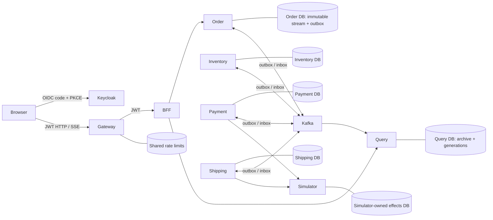
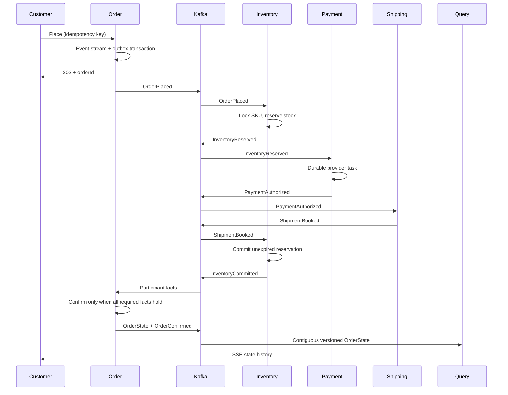
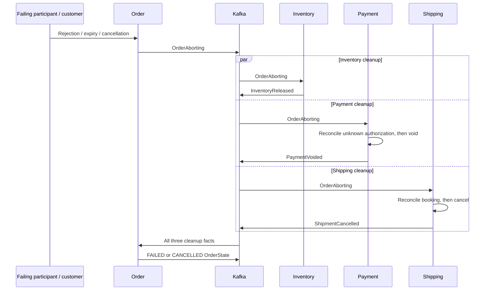

# Architecture and correctness

## Scope and assumptions

Single-line orders, integer quantities, USD/EUR/INR with two fractional digits, and a client-supplied demonstration amount. There is no catalog, pricing, tax, capture, refund, address, or carrier dispatch system. Payment and shipping are explicitly simulated. Shipping bookings remain cancellable in the simulator. A real carrier that cannot cancel must enter manual recovery, never report a fictitious cancellation. Inventory seed SKUs are DEMO (10,000), LAST (1), EMPTY (0).

The BFF combines the command-side version with the query projection. A missing/unavailable projection is marked degraded, with the authorized command-side state still available. All domain decisions remain in services. JWT issuer, signature, audience and expiry are validated independently at every HTTP boundary. Identity headers are ignored for authorization. The gateway strips common identity headers and rate limits by validated subject in Redis.

## Choreography

Order records participant facts and guards its own lifecycle; it does not issue reserve/pay/ship commands or schedule participant actions. Each participant reacts to the preceding domain fact. The OrderAborting integration event describes the order's irreversible decision, which participants independently compensate.

| Participant | State machine | Durable timeout / terminal behavior |
|---|---|---|
| Order | NEW → PENDING → CONFIRMED; PENDING → COMPENSATING → FAILED/CANCELLED; unresolved work → MANUAL_RECOVERY | `order_stream.deadline` 120 s; scheduler appends Aborting. CONFIRMED, FAILED, CANCELLED terminal. MANUAL_RECOVERY is not a successful terminal outcome. |
| Inventory | absent → RESERVED/REJECTED; RESERVED → COMMITTED/RELEASED; COMMITTED → RELEASED on abort; absent → RELEASED tombstone | 90 s reservation deadline. Row/order and SKU locks arbitrate expiry/commit. COMMITTED stops expiry, but remains compensatable. |
| Payment | absent → PENDING → SUCCEEDED/REJECTED/UNKNOWN; aborted → COMPENSATING → COMPENSATED; retry exhaustion → MANUAL | Durable `next_attempt`; unknown reconciles by provider key before a new call. Eight failed attempts require operator retry. |
| Shipping | Same owned task lifecycle, producing booking/cancellation facts | Simulator bookings support cancellation; unknown booking cannot be treated as failure. |
| Query | Archive received → wait for missing versions → apply contiguous versions | Duplicates inbox-deduplicated; stale versions cannot regress state. Gaps remain visible in metrics. |

Cancellation is accepted only before confirmation, serialized by the aggregate lock. Repeated cancellation is idempotent. A new cancellation requires `If-Match`; a stale version yields 409. Cancellation does not promise compensation has completed: the 202 state is COMPENSATING. If confirmation wins the lock first, cancellation returns 409. If abort wins, subsequent success facts cannot confirm. Inventory commitment and expiry use the same order lock, so expiry cannot undo a confirmed reservation. Abort tombstones prevent work from starting when its trigger arrives late. In-flight provider effects are reconciled and compensated.

## Event sourcing and persistence

Order domain events are immutable rows protected by a database trigger. Rehydration applies domain events only; it does not dispatch events or invoke providers. `order_stream.version` is a compare-and-set guard; `(aggregate_id, version)` is unique. Append, derived stream metadata, optional snapshot and integration outbox write share one transaction. Snapshots every five events are expendable. Full replay ignores them. Version 0 `customerId` is upcast to `customer`; unknown schemas fail closed. Public `OrderState` is a full representation; internal event names and storage are not the public contract.

Other services do not need event sourcing: stock is a service-owned Hibernate/JPA entity with a pessimistic write lock and an optimistic version; reservation/task/projection metadata uses explicit JDBC where PostgreSQL conditional updates and locking make the transaction boundary clearer. All use the same local transaction manager. No shared JPA entity or shared domain aggregate exists.

## Messaging guarantees

One topic, `fulfillment.v1`, six partitions, UUID orderId key, UTF-8 JSON. Each service has its own group named after its application. Kafka order is per partition, not global, and aggregateVersion is scoped to **producer + aggregate**, not globally across services. No partition-count changes while orders are active: rekey into a new topic/version during a controlled migration. Local Compose uses replication 1; production requires at least 3 replicas, min ISR 2 and authenticated TLS brokers.

Polling outbox: transactionally lock the oldest outstanding record per aggregate, SKIP LOCKED between workers, publish with a bounded broker acknowledgement, mark success in the same transaction. A later record is ineligible while an earlier record remains pending. A process crash after publish rolls back the marker, yielding a duplicate. Backoff uses persisted attempts and next_attempt, exponential cap 60 s plus jitter. Published outbox rows are retained seven days and cleaned hourly. Inbox/event archive retention is deliberately unbounded in this reference to make historic replay safe; establish archival and deduplication horizons before pruning in production.

Consumer inbox insertion, business change and resulting outbox are one database transaction. Acknowledgement occurs after its return. No claim of end-to-end exactly-once execution is made. Provider idempotency lives in the external simulator database and is independent of Kafka deduplication.

Failed records are copied once to a durable quarantine table and `fulfillment.dlt.v1` (30-day retention), while the source partition continues retrying at 1 s. It is **not** automatically skipped, and there are no retry topics that could overtake it. Operators repair the event/code and only then explicitly approve a skip; missing projection versions remain blocked until repaired. A quarantined poison record can delay unrelated aggregates on the same partition: alert and recover promptly. Do not simply reset offsets past failures.

## CQRS and live updates

Only OrderState builds the customer projection. Integration events are archived uniquely by event ID and order/version. Contiguous application waits on gaps; a version-2-before-version-1 test demonstrates this. A rebuild writes a fresh generation in short transactions while intake continues. The final catch-up takes the same cutover lock as ingestion, catches newly arrived orders and switches one generation pointer atomically. Readers use that pointer in their SQL statement. Old generations remain for operational rollback/inspection. Large datasets need a more incremental final catch-up before this reference's scan becomes expensive.

HTTP responses expose projectedAt, version and eventual consistency. The BFF exposes commandVersion alongside the projection. Immediately after 202, the query endpoint can return 404 until version 1 arrives; BFF details then return a degraded representation with authorized command state.

SSE uses the archived order version as Last-Event-ID, checks ownership, and replays missed contiguous states. More than 100 missed states or an invalid cursor returns a `reset` snapshot. Connections expire within 60 s or at JWT expiry and reconnect with a refreshed token. Eight scheduler workers and 128 connections per Query instance bound resources. BFF demand is bounded (16 request batches, 64 buffered events), disconnects propagate, and slow clients are disconnected on failure. History is database-backed, so reconnects can land on any instance. This polling design provides approximately one-second updates; it is intentionally modest in connection scale.

## Synchronous resilience

Provider connect timeout 1 s, response timeout 2 s, bulkhead 8, circuit minimum four calls in a six-call window, 50% failure threshold, 5 s open wait. Durable task retries use exponential backoff + jitter, capped at 30 s, eight attempts before manual recovery. Requests use a stable `(kind, orderId)` provider key; conflicting canonical request bodies return 409. A timeout does not mean failure.

BFF read calls have a 1 s connect timeout, bounded 3 s total budget, one transient retry with jitter, circuit protection and a 64-call bulkhead. Command POSTs are forwarded once with their durable idempotency key. The gateway allows 5 s for normal API routes; SSE has no overall route response timeout and uses heartbeats and bounded connection lifetimes. Kafka recovery uses durable local transactions and redelivery rather than HTTP fallbacks.
